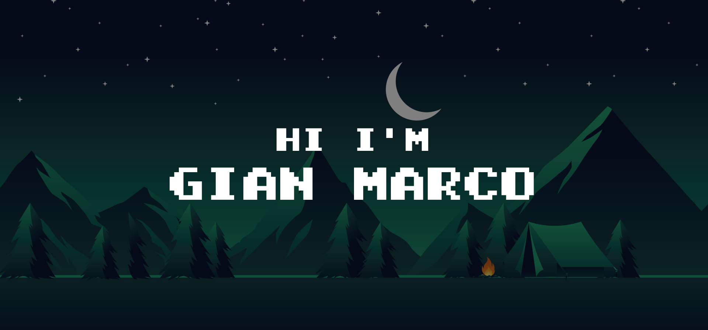

    
     
     
    
Hello, my name is Gian Marco. Currently, I am studying Systems and Informatics Engineering. I am passionate about all topics            related to technology, and I enjoy constantly learning new things. I have worked on personal web development projects and                intermediate-level university projects. In these projects, I have used technologies such as JavaScript, Vue.js, Java, JavaFX, and        Java Swing. Additionally, I have a keen interest in user experience (UX/UI) related aspects.

<h2 align="center">Contact</h2>

    
    &nbsp;&nbsp;&nbsp;
    
    &nbsp;&nbsp;&nbsp;
    
     
     

<h2 align="center">Technology Stack</h2>

  
  
  
  
  
  
  
  
  
  

